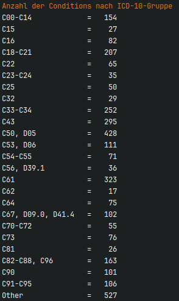

# BZKF Real World Data Platform - Plausibilitätsprüfung

Anwendung zur Durchführung einer Plausibilitätsprüfung anhand der Daten für die BZKF Real World Data Platform.

## Aufbau der ETL-Strecke an den Standorten

Die Daten werden aus der Onkostar-Datenbank ausgelesen und in Apache-Kafka eingespeist.
Nach Durchlauf der ETL-Strecke wird das Ergebnis in einer CSV-Datei gespeichert.
Diese wird dann (aktuell) manuell in OPAL importiert.

```mermaid
flowchart LR
    A[Database] --> B[Kafka-Connect]
    B --> C[ADT to FHIR]
    C --> D[fhir-pseudonymizer]
    D --> E[obds-fhir-to-opal]
    E -->|CSV-File| F[OPAL]
```

## Ermittelte Kennzahlen

Die Anwendung gibt für die möglichen Quellen der Kennzahlen die Anzahl der _Conditions_, gruppiert nach ICD-10 Gruppen,
aus.

Unterstützt wird eien OPAL-CSV-Datei (wie für BZKF vorgesehen) und eine Onkostar-Datenbank, basierend auf MariaDB oder
MySQL.



## Kennzahlen aus der CSV-Datei

Vor Veröffentlichung der Daten der CSV-Datei in Opal kann die Anzahl der _Conditions_, gruppiert nach ICD-10 Gruppen,
mit dem Befehl `opal-file` aus der CSV-Datei gewonnen werden.

```
bzkf-rwdp-check opal-file --file <Opal-CSV-Datei>.csv
```

Die Anwendung gibt nun eine Liste der ICD-10-Gruppen mit Anzahl der _Conditions_ aus.

## Kennzahlen aus der Onkostar-Datenbank

Die Anzahl der _Conditions_, gruppiert nach ICD-10-Gruppe, kann auch mit dem Befehl `database` aus der
Onkostar-Datenbank abgerufen werden.

```
bzkf-rwdp-check database --user me --year 2024
```

Die Anwendung gibt auch hier eine Liste der ICD-10-Gruppen mit Anzahl der _Conditions_ aus.

Dieser Befehl hat noch weitere Parameter:

```
Options:
  -D, --database <DATABASE>  Datenbank-Name [default: onkostar]
  -h, --host <HOST>          Datenbank-Host [default: localhost]
  -P, --port <PORT>          Datenbank-Host [default: 3306]
  -p, --password <PASSWORD>  Passwort. Wenn nicht angegeben, wird danach gefragt
  -u, --user <USER>          Benutzername
  -y, --year <YEAR>          Jahr der Diagnose
```

Der zusätzliche Parameter `--ignore-exports-since` ist optional.
Wird er angegeben, werden keine Einträge mit Exportdatum ab diesem Datum verwendet.
Dies eignet sich um nachträglich Zahlen zu einem bestimmten Datum zu ermitteln.

Der optionale Parameter `--include-extern` schließt Meldungen mit externer Diagnosestellung ein.
Diese sind normalerweise nicht enthalten.
Die Entscheidung, ob eine Meldung intern oder extern gemeldet wird, wird anhand der `Melder_ID` getroffen.
Enthält diese die Zeichenkette `9999` wird von einer externen Meldung ausgegangen.

Der optionale Parameter `--include-histo-zyto` schließt Meldungen mit Meldeanlass `histologhie_zytologie` ein.
Diese sind normalerweise ebenfalls nicht enthalten.

Mit dem optionalen Parameter `--schema-versions` werden die Angaben zudem noch oBDS-Schema-Version getrennt ausgegeben.

## Export aus der Onkostar-Datenbank

Die Anwendung ist in der Lage, mit dem Befehl `export` die Spalten

* `pat_id`: Patienten-ID (optional über Parameter `--pat-id`)
* `cond_id`: Condition-ID
* `conditiondate`: Datum der Diagnose
* `condcodingcode`: Der ICD-10-Code der Diagnose

in eine CSV-Datei zum Abgleich mit der OPAL-CSV-Datei zu exportieren.

Hierbei gelten die gleichen Datenbank-Parameter wie
unter [Kennzahlen aus der Onkostar-Datenbank](#kennzahlen-aus-der-onkostar-datenbank), zusätzlich gibt es noch die
folgenden Parameter:

```
Options:
      --pat-id               Export mit Klartext-Patienten-ID
  -o, --output <OUTPUT>      Ausgabedatei
      --xls-csv              Export mit Trennzeichen ';' für Excel
```

## Vergleich CSV-Datei für OPAL und Onkostar-Datenbank

Die Anwendung kann auch die Conditions in der CSV-Datei mit der Onkostar-Datenbank direkt vergleichen.

Hierzu kann der Befehl `compare` genutzt werden. Dieser verwendet alle Optionen für die Datenbank und die
Option `--file` für die CSV-Datei und gibt eine Übersicht auf der Konsole aus.

## Vergleich der XML-basierten LKR-Export-Protokolldatei mit der Datenbank

Mithilfe dieser Anwendung kann auch der aktuelle Inhalt der Datenbank gegen die LKR-Export-Protokolldatei für einen
Export verglichen werden.

Der Befehl `check-export` kann zusammen mit der Angabe der Protokolldatei (`--file`) und der Angabe des
Exports (`--package=...` bzw. `--export-package=...`) und den Optionen für den Datenbankzugriff ausgeführt werden.

Zur Überprüfung werden irrelevante Leerzeichen und Zeilenumbrüche entfernt und _Self-Closed-Tags_ ersetzt
(`<Meldeanlass />` => `<Meldeanlass></Meldeanlass>`),
da in Onkostar in der Datenbank und der LKR-Export-Protokolldatei verschiedene Formatierungen verwendet werden (können).